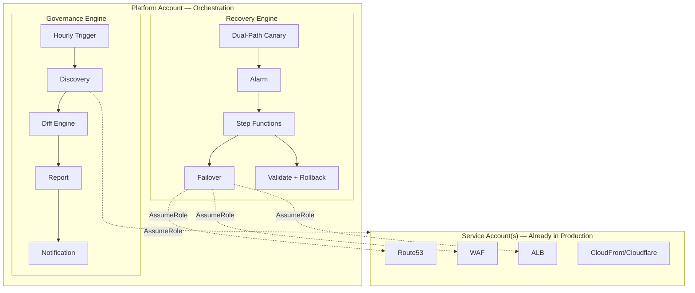
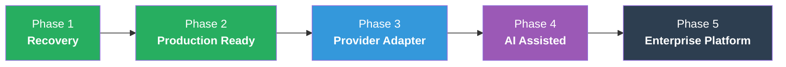

<div align="center">

# 🛡️ EERF

### Enterprise Edge Recovery Framework

A reusable engineering framework for **discovering, validating, recovering, and governing** edge services in a standardized and automated manner.

<br>


<br>

| MTTR | Intervention | Architecture | Governance | Scale |
|:----:|:----:|:----:|:----:|:----:|
| **30min → 3min** | **Zero-touch** | **AWS Native** | **GitOps** | **Multi-Account** |

</div>

<br>


*Recover Automatically. Govern Safely. — Total elapsed < 3 minutes.*

---

## Quick Start

```bash
# 1. Deploy Platform (orchestration + governance)
cd platform/ && cp terraform.tfvars.example terraform.tfvars
terraform init && terraform apply

# 2. Deploy Trust Role in Service Account
cd ../service/ && cp terraform.tfvars.example terraform.tfvars
terraform init && terraform apply

# 3. Discovery runs hourly → report arrives via email

# 4. Approve discovered services
eerf approve app-example-1111 --reason "Production ready"

# 5. Protected ✓ (Canary + Auto-failover active)
```

**Time to first protection: ~15 minutes**

---

## Why EERF?

| | Traditional DNS Failover | EERF |
|:--|:--|:--|
| **Detection** | Health check (origin only) | Canary cross-validation (CDN + Origin) |
| **Decision** | Binary UP/DOWN | Decision Engine (Edge-only fault isolation) |
| **Recovery** | DNS switch only | DNS + WAF hardening + SG + Validation |
| **Rollback** | None | Auto-rollback on validation failure |
| **Scope** | Single account | Multi-Account (Organizations) |
| **Governance** | None | GitOps Approval + Audit trail |
| **Onboarding** | Manual per-service | Auto-discovery + Approval workflow |
| **Visibility** | Alarm only | Dashboard + Hourly report + Drift detection |

---

## Framework Architecture



---

## Core Capabilities

| # | Capability | Value |
|---|-----------|-------|
| 1 | **Dual-Path Canary** | Detects Edge-only failures accurately (no false positives) |
| 2 | **Decision Engine** | Standardized Detect → Decide → Execute → Validate workflow |
| 3 | **Post-Switch Validation** | Auto-rollback if recovery fails (safety guarantee) |
| 4 | **WAF Auto-Hardening** | Instant origin protection when CDN is bypassed |
| 5 | **Governance Pipeline** | Auto-discover unprotected services + drift detection |

---

## Workflow

```
┌─────────────────────────────────────────────────────────┐
│                  EERF Lifecycle                           │
├──────────┬──────────┬──────────┬──────────┬─────────────┤
│ Discovery│ Approval │Onboarding│ Runtime  │  Recovery   │
│          │          │          │          │             │
│ Org scan │ Human    │ JSON +   │ Canary   │ FO → Valid  │
│ Auto-find│ approve  │ tf apply │ 1min     │ → Rollback? │
│          │          │          │ check    │             │
└──────────┴──────────┴──────────┴──────────┴─────────────┘
```

---

## Documentation

| Document | Audience | Content |
|----------|----------|---------|
| **[Product Overview](docs/00-product-overview.md)** | Anyone | What is EERF, 3-minute understanding |
| **[Executive Summary](docs/01-executive-summary.md)** | CTO / VP | Business value, ROI, positioning |
| **[Architecture](docs/02-architecture.md)** | Engineers | Core capabilities + technical deep dive |
| **[Test Runbook](docs/04-test-runbook.md)** | Operators | E2E test scenarios + checklists |
| **[Operations Guide](docs/06-operations-guide.md)** | Operators | Day-to-day operations |

### Component Deep Dive

| Component | Document |
|-----------|----------|
| Canary & Monitoring | [docs/components/canary.md](docs/components/canary.md) |
| Failover & Failback | [docs/components/failover.md](docs/components/failover.md) |
| DNS Validation & Rollback | [docs/components/dns-validate.md](docs/components/dns-validate.md) |
| Governance Pipeline | [docs/components/governance.md](docs/components/governance.md) |
| Approval State Machine | [docs/components/approval.md](docs/components/approval.md) |
| Security (IAM/WAF/Network) | [docs/components/security.md](docs/components/security.md) |

### Design Decisions

| ADR | Decision | Rationale |
|-----|----------|----------|
| [001](docs/adr/ADR-001-platform-service-separation.md) | Platform / Service separation | Least privilege, multi-account |
| [002](docs/adr/ADR-002-discovery-approval-model.md) | Discovery + Approval | Auto-discover, human-approve |
| [003](docs/adr/ADR-003-dead-origin-simulation.md) | Dead Origin testing | Safe CDN failure simulation |
| [004](docs/adr/ADR-004-canary-dual-path-check.md) | Dual-path canary | Edge-only fault detection |
| [005](docs/adr/ADR-005-waf-count-to-block.md) | WAF auto-hardening | Origin protection without CDN |
| [006](docs/adr/ADR-006-manual-failback.md) | Manual failback | Prevent premature rollback |

---

## Design Principles

| Principle | Description |
|-----------|-------------|
| **GitOps First** | All state changes via code. JSON file = service config. |
| **Infrastructure as Code** | Terraform manages everything. Repeatable, auditable. |
| **Human Approval** | Auto-discover, but never auto-enroll. Governance first. |
| **Safe Automation** | Every automated action has validation + rollback path. |
| **Extensible Architecture** | Provider Adapter pattern for multi-CDN expansion. |

---

## Roadmap



| Phase | Focus | Status |
|:---:|:---|:---:|
| **1** | Recovery — Single-account automated FO/FB | ✅ |
| **2** | Production Ready — Multi-Account, Governance, Dashboard, CLI | ✅ |
| **3** | Provider Adapter — Cloudflare/Akamai/Fastly, unified policy | 📋 |
| **4** | AI Assisted — Prediction, auto-tuning, incident correlation | 💡 |
| **5** | Enterprise Platform — Service Catalog, Portal, Compliance | 💡 |

---

## Vision

<div align="center">

**Recovery Tool → Edge Resilience Accelerator → Enterprise Resilience Platform**

| | Now (Phase 2) | Next (Phase 3) | Future (Phase 5) |
|:--|:--|:--|:--|
| **Scope** | CloudFront recovery | Multi-CDN orchestration | Any Edge, self-healing |
| **Governance** | Approval + Reports | Unified multi-vendor policy | SOC2 / ISO compliance |
| **Operations** | Rule-based | Provider-aware correlation | AI-assisted |
| **Integration** | Terraform + CLI | Provider APIs | Service Catalog + Portal |

</div>

---

## Contributing

Contributions welcome. Please read the [Architecture](docs/02-architecture.md) and [Design Principles](#design-principles) before submitting PRs.

## License

MIT
