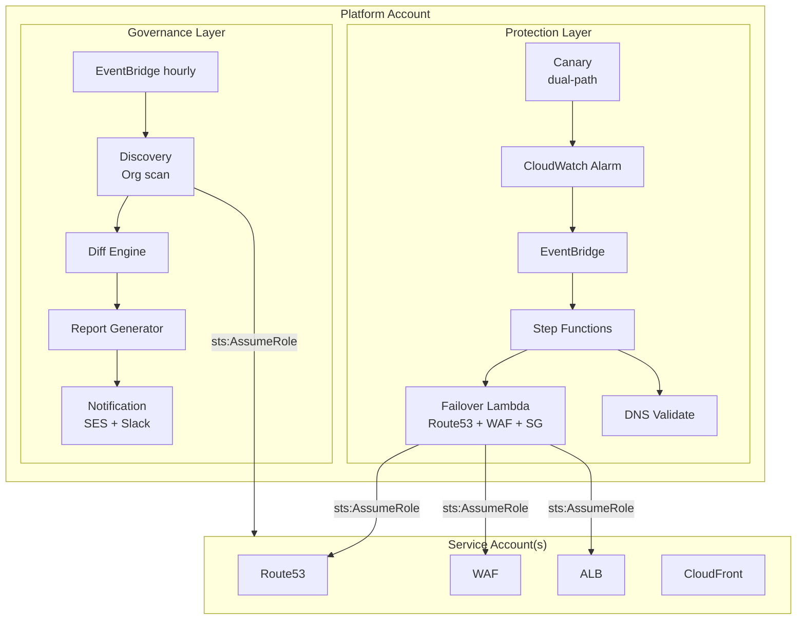
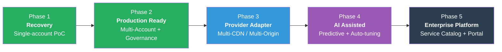

<div align="center">

# 🛡️ EERF

### Enterprise Edge Recovery Platform

**Recover Automatically. Govern Safely.**

3-minute automated recovery when your CDN fails — zero operator intervention.

<br>


<br>

| MTTR | Intervention | Architecture | Governance | Scale |
|:----:|:----:|:----:|:----:|:----:|
| **30min → 3min** | **Zero-touch** | **AWS Native** | **GitOps** | **Multi-Account** |

</div>

<br>


*Total elapsed: < 3 minutes — fully automated, zero operator intervention*

---

## Quick Start

```bash
# 1. Deploy Platform Account (orchestration + governance)
cd platform/
cp terraform.tfvars.example terraform.tfvars
terraform init && terraform apply

# 2. Deploy Trust Role in each Service Account
cd ../service/
cp terraform.tfvars.example terraform.tfvars
terraform init && terraform apply

# 3. Discovery runs automatically (hourly) → email arrives

# 4. Approve discovered services
eerf approve app-example-1111 --reason "Production ready"

# 5. Service is now protected ✓ (Canary + Auto-failover active)
```

**Time to first protection: ~15 minutes**

---

## Why EERF? (vs Traditional DNS Failover)

| | Traditional Route53 Failover | EERF |
|:--|:--|:--|
| **Detection** | Simple health check | Canary cross-validation (CDN + Origin) |
| **Decision** | Binary UP/DOWN | Decision Engine (Edge-only fault isolation) |
| **Recovery** | DNS failover only | DNS + WAF hardening + SG automation |
| **Scope** | Single account | Multi-Account (Organizations) |
| **Governance** | None | GitOps Approval + Audit trail |
| **Visibility** | CloudWatch alarm | Dashboard + Hourly scan + Reports |
| **Rollback** | Manual | Auto-rollback on validation failure |
| **Onboarding** | Manual per-service | Auto-discovery + Approval workflow |

**Route53 Failover solves "is my origin alive?"**  
**EERF solves "my CDN is dead, recover the entire path safely."**

---

## Problem

Your services depend on external CDN (Cloudflare, Akamai, Fastly). When the CDN fails:

- 🔴 **Manual DNS change** takes 30 minutes to hours
- 🔴 **Can't distinguish** Edge failure vs Origin failure
- 🔴 **Origin exposed** without CDN protection layer
- 🔴 **No standard procedure** — every team does it differently
- 🔴 **New services unprotected** — onboarding takes days
- 🔴 **No visibility** — changes go undetected

---

## Architecture



---

## Runtime Flow

```
  Normal:     User → CDN → ALB → App        (Canary checks both paths ✓)

  Failure:    Canary: CDN ✗ + Origin ✓ → ALARM
              → Step Functions:
                1. Route53: CNAME → ALB       (bypass CDN)
                2. WAF: COUNT → BLOCK         (harden origin)
                3. ALB: Emergency SG          (allow direct)
                4. Wait 45s → Validate        (health check)
                5. Fail? → auto rollback
              → Notification sent, Audit logged

  Recovered:  User → ALB (direct) → WAF(BLOCK) → App ✓    (< 3 min)

  Failback:   Operator confirms CDN back → Manual SFN
              → Route53 → CF, WAF → COUNT, SG detach → Validate
```

---

## Repository Structure

```
eerf/
├── platform/                    # 🎛️  Orchestration + Governance
│   ├── canary.tf                    # Synthetics canary (dual-path)
│   ├── canary-token.tf              # Token rotation (90-day)
│   ├── failover.tf                  # Failover/Failback Step Functions
│   ├── failover-lambda.tf           # FO/FB/Validate Lambda
│   ├── discovery.tf                 # Service discovery (Organizations)
│   ├── scan-pipeline.tf             # Governance: Diff → Report → Notify
│   ├── dashboard.tf                 # CloudWatch dashboards
│   ├── iam-cross-account.tf         # Cross-account IAM
│   ├── ses.tf                       # SES email delivery
│   ├── services.tf                  # Service config loader
│   ├── ssm-services.tf              # SSM Parameter Store
│   ├── storage.tf                   # S3 audit + SNS
│   ├── lambda/                      # Python Lambda source
│   │   ├── discovery.py             # Organizations cross-account scan
│   │   ├── failover.py              # DNS + WAF + SG automation
│   │   ├── failback.py              # Restore to CDN path
│   │   ├── dns_validate.py          # Post-switch health check
│   │   ├── diff_engine.py           # Snapshot comparison
│   │   ├── report_generator.py      # HTML governance report
│   │   ├── notification.py          # SES + Slack + SNS
│   │   ├── approval_state.py        # Approval state machine
│   │   ├── exclude_services.py      # Exclusion management
│   │   ├── metrics.py               # CloudWatch metrics
│   │   ├── token_rotation.py        # Canary token rotation
│   │   └── onboarding_pr.py         # Auto-PR for new services
│   ├── canary/canary.py             # Synthetics handler
│   └── services/                    # Per-service JSON configs
│
├── service/                     # 🏗️  Service Account (infra + trust)
│   ├── network.tf, alb.tf, waf.tf, cdn.tf, compute.tf
│   ├── dns.tf, acm.tf, dashboard.tf
│   └── iam-platform-trust.tf        # Cross-account trust roles
│
├── tools/eerf-cli/              # 🔧  CLI (approve/defer/exclude)
│
└── docs/                        # 📚  Documentation + ADRs
```

---

## Key Design Decisions

| # | Decision | Rationale |
|---|----------|----------|
| [ADR-001](docs/adr/ADR-001-platform-service-separation.md) | Platform / Service separation | Least privilege, multi-account scale |
| [ADR-002](docs/adr/ADR-002-discovery-approval-model.md) | Discovery + Approval model | Auto-discover, human-approve |
| [ADR-003](docs/adr/ADR-003-dead-origin-simulation.md) | Dead Origin testing | Safe CDN failure simulation |
| [ADR-004](docs/adr/ADR-004-canary-dual-path-check.md) | Dual-path canary | Only failover when Edge is the problem |
| [ADR-005](docs/adr/ADR-005-waf-count-to-block.md) | WAF auto-hardening | Origin protection without CDN |
| [ADR-006](docs/adr/ADR-006-manual-failback.md) | Manual failback | Prevent premature rollback |

---

## Roadmap



| Phase | Focus | Key Deliverables | Status |
|:---:|:---|:---|:---:|
| **1** | Recovery | CloudFront failover, single account | ✅ Done |
| **2** | Production Ready | Multi-Account, Governance Pipeline, Dashboard, CLI | ✅ Done |
| **3** | Provider Adapter | Cloudflare/Akamai/Fastly adapters, unified policy model | 📋 Next |
| **4** | AI Assisted | Anomaly prediction, auto-tuning thresholds, incident correlation | 💡 Planned |
| **5** | Enterprise Platform | Service Catalog, Portal UI, SOC2/ISO compliance, AFT integration | 💡 Planned |

**Why this order?**
- Multi-vendor Recovery Orchestration (Phase 3) has the highest market differentiation — competitors can bolt on AI, but unified multi-CDN control under a single governance model is architecturally hard.
- AI (Phase 4) amplifies value *on top of* multi-vendor data; it needs operational history across providers to be meaningful.
- Enterprise Platform (Phase 5) is the capstone that turns a tool into a product.

---

## Vision

<div align="center">

**From Recovery Tool → Edge Resilience Accelerator → Enterprise Resilience Platform**

| | Phase 2 (Now) | Phase 3 | Phase 5 |
|:--|:--|:--|:--|
| **Providers** | CloudFront | + Cloudflare, Akamai, Fastly | Any Edge |
| **Recovery** | Automated failover | Provider-aware orchestration | Self-healing |
| **Governance** | Approval + Reports | Unified policy across vendors | SOC2/ISO compliance |
| **Operations** | Rule-based | Multi-vendor correlation | AI-assisted |
| **Integration** | Terraform + CLI | Provider APIs + Webhooks | Service Catalog + Portal |
| **Positioning** | CDN Failover tool | Edge Resilience Accelerator | Enterprise Resilience Platform |

</div>

---

## Contributing

Contributions welcome. Please read the [Architecture doc](docs/02-architecture.md) before submitting PRs.

---

## License

MIT
